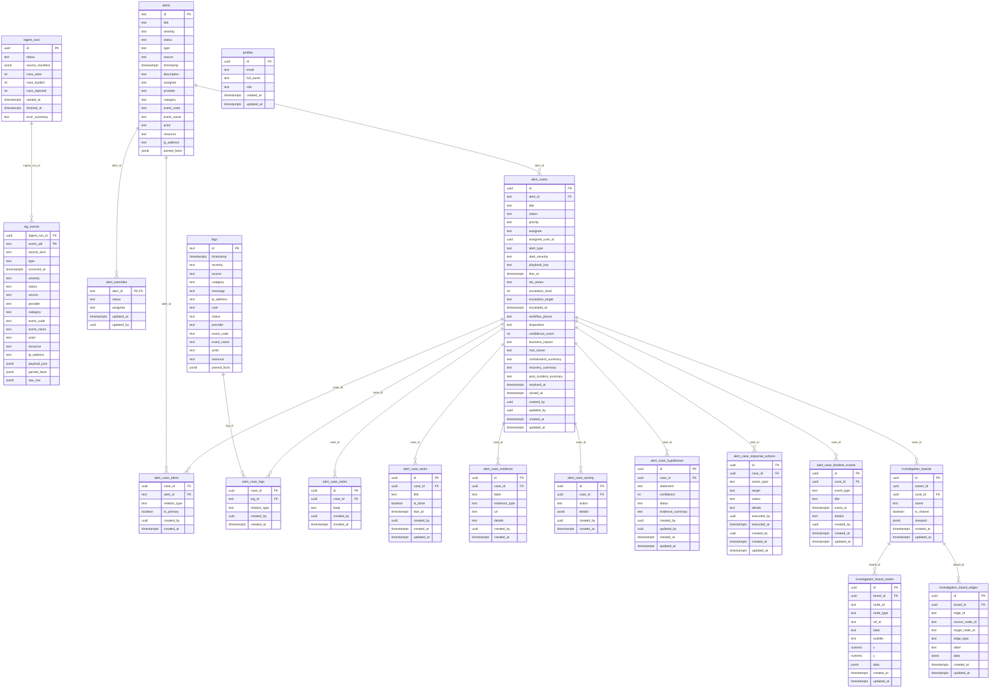

# Database ER Diagram

This diagram covers the operational SOC domain (ingest, alerts/logs, cases, boards, and user/profile-owned records).

```mermaid
erDiagram
    ingest_runs ||--o{ stg_events : "ingest_run_id"

    alerts ||--o{ alert_overrides : "alert_id"
    alerts ||--o{ alert_cases : "alert_id"
    alerts ||--o{ alert_case_alerts : "alert_id"

    logs ||--o{ alert_case_logs : "log_id"

    alert_cases ||--o{ alert_case_notes : "case_id"
    alert_cases ||--o{ alert_case_tasks : "case_id"
    alert_cases ||--o{ alert_case_evidence : "case_id"
    alert_cases ||--o{ alert_case_activity : "case_id"
    alert_cases ||--o{ alert_case_alerts : "case_id"
    alert_cases ||--o{ alert_case_logs : "case_id"
    alert_cases ||--o{ alert_case_hypotheses : "case_id"
    alert_cases ||--o{ alert_case_response_actions : "case_id"
    alert_cases ||--o{ alert_case_timeline_events : "case_id"
    alert_cases ||--o{ investigation_boards : "case_id"

    investigation_boards ||--o{ investigation_board_nodes : "board_id"
    investigation_boards ||--o{ investigation_board_edges : "board_id"

    profiles {
      uuid id PK
      text email
      text full_name
      text role
      timestamptz created_at
      timestamptz updated_at
    }

    ingest_runs {
      uuid id PK
      text status
      jsonb source_manifest
      int rows_seen
      int rows_loaded
      int rows_rejected
      timestamptz started_at
      timestamptz finished_at
      text error_summary
    }

    stg_events {
      uuid ingest_run_id FK
      text event_uid PK
      text source_kind
      text type
      timestamptz occurred_at
      text severity
      text status
      text source
      text provider
      text category
      text event_code
      text event_name
      text actor
      text resource
      text ip_address
      jsonb payload_json
      jsonb parsed_facts
      jsonb raw_row
    }

    alerts {
      text id PK
      text title
      text severity
      text status
      text type
      text source
      timestamptz timestamp
      text description
      text assignee
      text provider
      text category
      text event_code
      text event_name
      text actor
      text resource
      text ip_address
      jsonb parsed_facts
    }

    logs {
      text id PK
      timestamptz timestamp
      text severity
      text source
      text category
      text message
      text ip_address
      text user
      text status
      text provider
      text event_code
      text event_name
      text actor
      text resource
      jsonb parsed_facts
    }

    alert_overrides {
      text alert_id PK,FK
      text status
      text assignee
      timestamptz updated_at
      uuid updated_by
    }

    alert_cases {
      uuid id PK
      text alert_id FK
      text title
      text status
      text priority
      text assignee
      uuid assignee_user_id
      text alert_type
      text alert_severity
      text playbook_key
      timestamptz due_at
      text sla_status
      int escalation_level
      text escalation_target
      timestamptz escalated_at
      text workflow_phase
      text disposition
      int confidence_score
      text business_impact
      text root_cause
      text containment_summary
      text recovery_summary
      text post_incident_summary
      timestamptz resolved_at
      timestamptz closed_at
      uuid created_by
      uuid updated_by
      timestamptz created_at
      timestamptz updated_at
    }

    alert_case_notes {
      uuid id PK
      uuid case_id FK
      text body
      uuid created_by
      timestamptz created_at
    }

    alert_case_tasks {
      uuid id PK
      uuid case_id FK
      text title
      boolean is_done
      timestamptz due_at
      uuid created_by
      timestamptz created_at
      timestamptz updated_at
    }

    alert_case_evidence {
      uuid id PK
      uuid case_id FK
      text label
      text evidence_type
      text url
      text details
      uuid created_by
      timestamptz created_at
    }

    alert_case_activity {
      uuid id PK
      uuid case_id FK
      text action
      jsonb details
      uuid created_by
      timestamptz created_at
    }

    alert_case_alerts {
      uuid case_id FK
      text alert_id FK
      text relation_type
      boolean is_primary
      uuid created_by
      timestamptz created_at
    }

    alert_case_logs {
      uuid case_id FK
      text log_id FK
      text relation_type
      uuid created_by
      timestamptz created_at
    }

    alert_case_hypotheses {
      uuid id PK
      uuid case_id FK
      text statement
      int confidence
      text status
      text evidence_summary
      uuid created_by
      uuid updated_by
      timestamptz created_at
      timestamptz updated_at
    }

    alert_case_response_actions {
      uuid id PK
      uuid case_id FK
      text action_type
      text target
      text status
      text details
      uuid executed_by
      timestamptz executed_at
      uuid created_by
      timestamptz created_at
      timestamptz updated_at
    }

    alert_case_timeline_events {
      uuid id PK
      uuid case_id FK
      text event_type
      text title
      timestamptz event_at
      text details
      uuid created_by
      timestamptz created_at
      timestamptz updated_at
    }

    investigation_boards {
      uuid id PK
      uuid owner_id
      uuid case_id FK
      text name
      boolean is_shared
      jsonb viewport
      timestamptz created_at
      timestamptz updated_at
    }

    investigation_board_nodes {
      uuid id PK
      uuid board_id FK
      text node_id
      text node_type
      text ref_id
      text label
      text subtitle
      numeric x
      numeric y
      jsonb data
      timestamptz created_at
      timestamptz updated_at
    }

    investigation_board_edges {
      uuid id PK
      uuid board_id FK
      text edge_id
      text source_node_id
      text target_node_id
      text edge_type
      text label
      jsonb data
      timestamptz created_at
      timestamptz updated_at
    }
```
